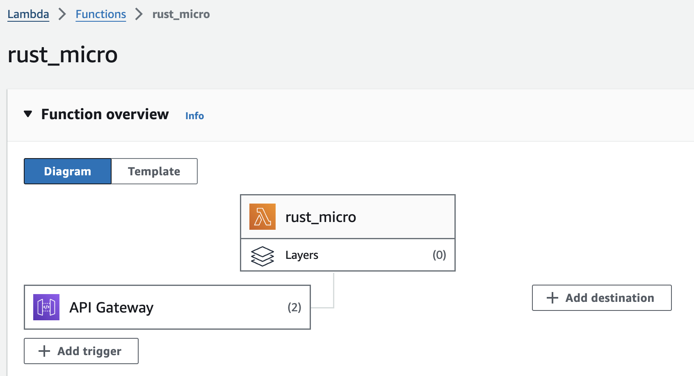
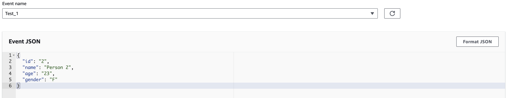
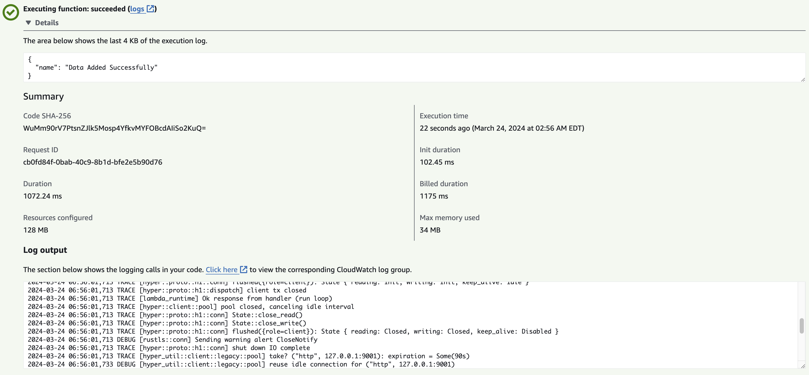
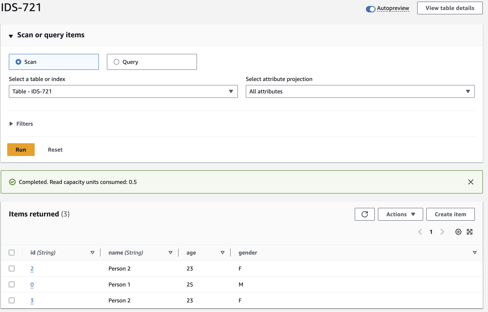
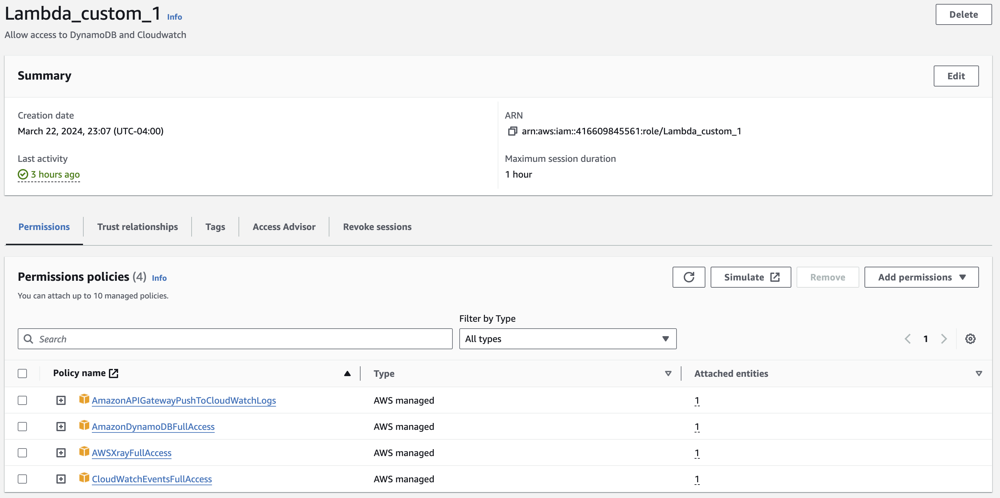
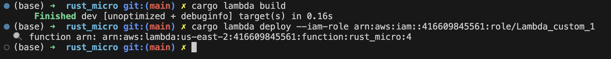

# Serverless Rust Microservice
[](https://github.com/nogibjj/IDS-721_rg361_week-05/actions/workflows/cicd.yml)

## Overview

This simple AWS Lambda funtion takes in input from the user in JSON format and uploads the Data to ``DynamoDB`` table in AWS.

The function is programmed in ``Rust`` and is deployed using ``Cargo Lambda`` and ``AWS CLI``.



## Sample Execution

The function is tested in the AWS Lambda console with the following input parameters:



Lambda Function successfull execution response is shown below:



The data is successfully uploaded to the DynamoDB table as shown below:



## Prior Setup
1. Create a DynamoDB table in AWS with the desired configuration.
2. Create an IAM role with the required permissions to access the DynamoDB table.  
    find the policy used in this project below:

    

## Development

1. Install [Cargo Lambda](https://www.cargo-lambda.info/) and [AWS CLI](https://aws.amazon.com/cli/) following the instructions in the respective links.
2. Setup the AWS CLI with the required credentials
3. Create the project repository and clone the repository to the local machine
4. navigate to the project repository and run the following command to create a new project:
    ```bash
    cargo lambda new <project_name>
    ```
5. Navigate to the newly created folder and develop the rust function as required
6. Test the function locally using the following commands (check the [Cargo Lambda](https://www.cargo-lambda.info/) documentation for more details):
    ```bash
    cargo lambda watch
    ```
    ```bash
    cargo lambda invoke
    ```
7. Once the function is tested and ready, deploy the function to AWS Lambda using the following command:
    ```bash
    cargo lambda build
    ```
    ```bash
    cargo lambda deploy --iam-role <role_arn>
    ```
    

8. The function is now deployed and can be tested in the AWS Lambda console as shown in the [Sample Execution](#sample-execution) section.
9. Add the API Gateway trigger to the function as per the requirement.
